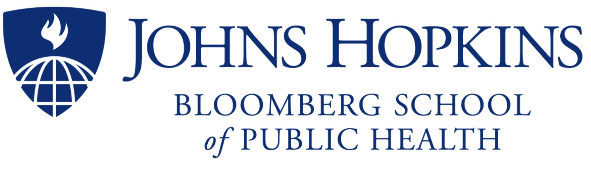

A Text Predictor Application
========================================================
author: Umar Ayoub
autosize: true

<h3>Predicting Text using Ngrams</h3>
+ Coursera

 

+ Johns HopkinsBloomberg School of Public Health

 

+ Swiftkey

 

              
                      

Overview
========================================================

***The objective of this project is to build working predictive text model***

**The App is a web-based application built in Shiny**

**The data used in this model came form **corpus** called HC Corpora**

**The algorithm was based on a classic **N-gram** model**

**The n-gram objects are saved as R-Compressed files**

Data
======================================================== 
The data provided consisted of 3 large files blogs, twitter, news.
A subset of the original data was sampled.
Sampling the data was necessary as it improved the performance
And reduced the work load making the analysis and model trainig easy

Data cleaning was done by coversion to lowercase, strip white space, removing punctuation and numbers.

The data used for building the __predictive model__ was provided by [HC Corpora] (http://www.corpora.heliohost.org/)

 
* More information can be found in the <a href="https://rpubs.com/UmAr1103/582328">Capstone milestone report</a>

The App NxWord
=======================================================
A shiny application NxWord that accepts a 
phrase as input, suggests word, sentence completion from the unigrams, and predicts the most likely next word based 
on the linear interpolation of fourgrams, trigrams, bigrams, and unigrams.
The application can be found at
<a href="https://umar1103.shinyapps.io/nxWords/"> **Here**</a>

<h3> Using The Application </h3>
To use the App, Type word or sentence in the input box
Use the Go button to get the predicted word
After Getting the first predicted word try to input the predicted word 
in the input box

